<h1 align="center">Hamlet Admin</h1>

<div align="center">

Next.js + MaterialUI（MUI）实现的若依(ruoyi)系的现代化企业级中后台前端解决方案。element-ui，antd已经审美疲劳，可以的体验下Material-UI（MUI）的设计风格
<br />
支持 React 19 / 18，Next.js 15+，Materail UI，zustand。

[](https://react.dev/)
[](https://nextjs.org/)
[](https://mui.com/)
[](https://zustand.docs.pmnd.rs/getting-started/introduction/)
[](./LICENSE)

</div>

# 在线演示

- 在线预览 （准备中）
- 文档地址

# 核心特性

- **接口对接 ruoyi-vue-plus**
  用户管理、角色管理、部门管理、岗位管理、字典管理、参数设置、通知公告、日志管理、文件管理、客户端管理、菜单管理等核心功能已对接，无需配置，开箱即用。

- **真正的业务分层**
  代码分层明确，业务与 UI 解耦，结构清晰，易于维护与扩展。

- **NextJS 完美适配**
  支持 App 模式下的 配套 Tab 窗口，体验和element-ui，antd接近

- **Node.js 赋能开发**
  支持约定式路由，可视化生成路由与状态仓库，大幅提升开发效率。

- **状态管理**
  轻量级的状态管理库Zustand，使用非常简单，目标是提供一个无需复杂 API 和概念的全局状态管理解决方案

  - **简单易用**：不需要 reducer、action 或复杂的概念。
  - **高效**：支持按需订阅状态，避免不必要的重渲染。
  - **灵活**：可以与 React、React Native 和其他框架一起使用。
  - **无依赖**：没有第三方依赖，体积小。

- 表单校验zod

  TypeScript 优先的模式声明和验证库Zod

# 技术选型

- React 18 / React 19
- Next.js 15
- Material UI（MUI）
- Zustand
- Zod
- App Router
- TypeScript

# 快速开始

## 本地运行

### 配置修改

`.env.development`文件里的NEXT_PUBLIC_API_BASE_URL改成自己的后端地址

```
NEXT_PUBLIC_API_BASE_URL = 'http://ip:端口/dev-api'
```

### 前端启动

```bash
# 安装依赖
npm i

# 启动服务
npm run dev
```

### 后端说明

本地开发推荐启动 ruoyi-vue-plus 项目进行接口对接。

# 项目结构说明

- `api/`：项目的请求接口目录

- `app/`：主应用目录，所有前端页面

- `components/`：页面组件

- `stores/`：状态管理相关目录（zustand）。

- `styles/`：样式相关目录。

# 功能截图

## PC端

### 首页

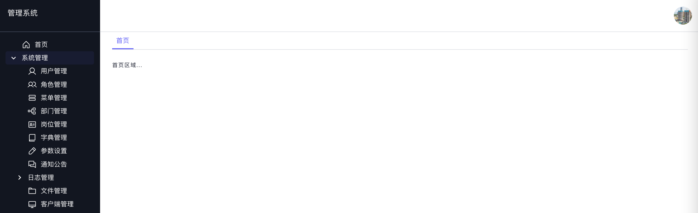

### 用户管理


### 角色管理

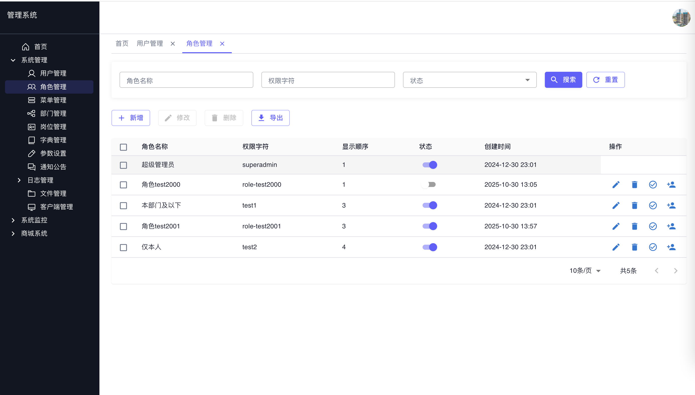

### 部门管理

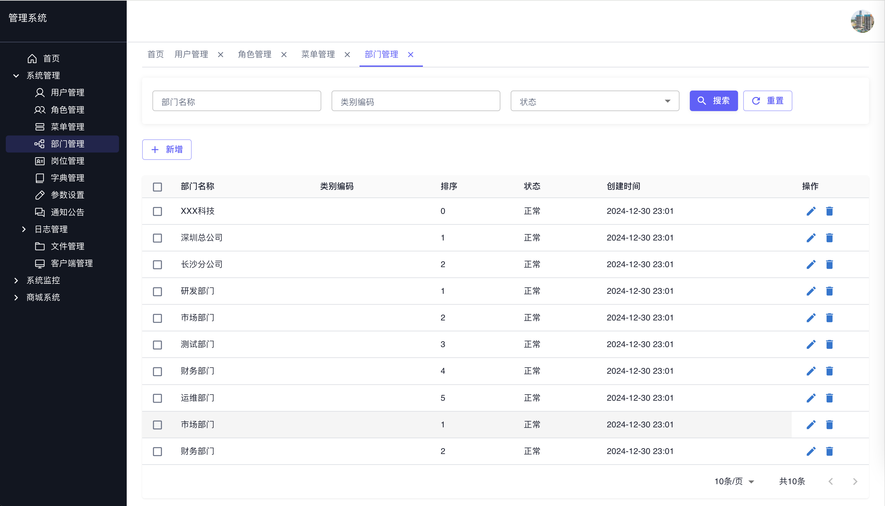

### 岗位管理

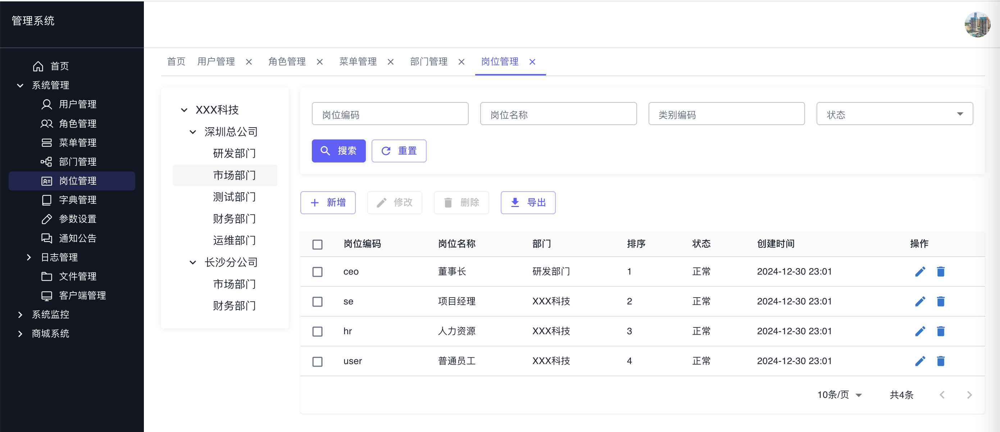

### 字典管理

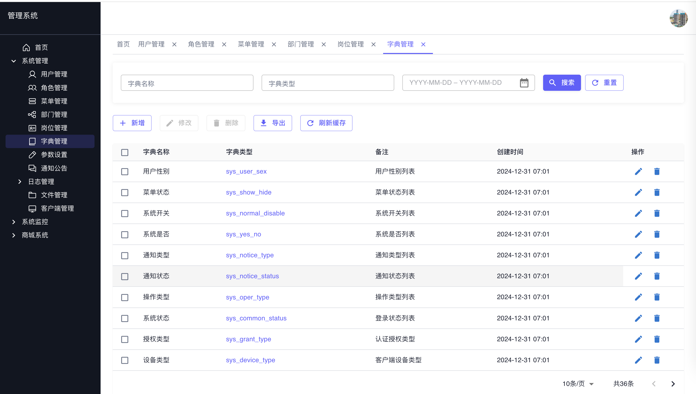

### 参数配置


### 公告管理

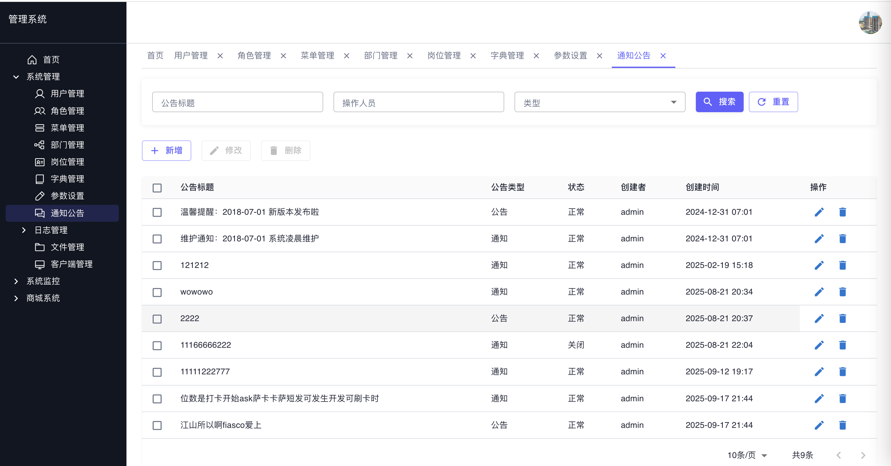

### 日志管理

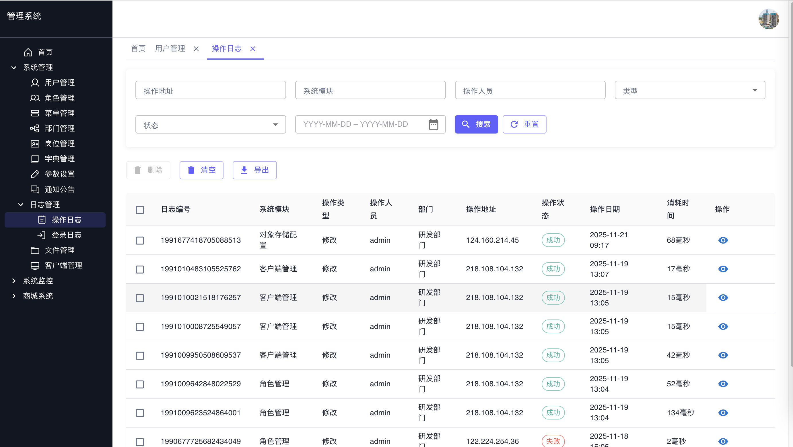

### 文件管理

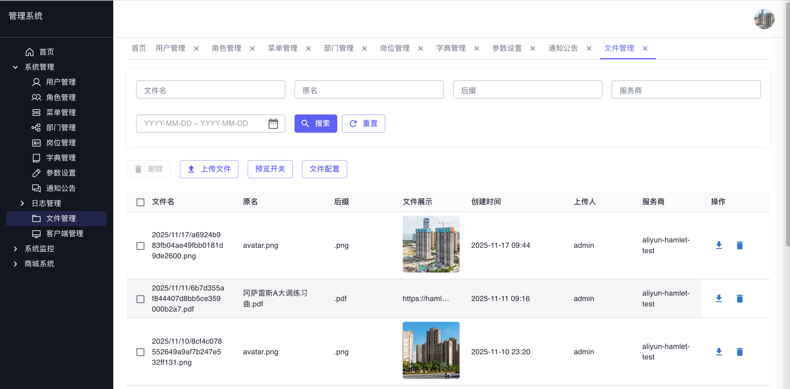

### 客户端管理

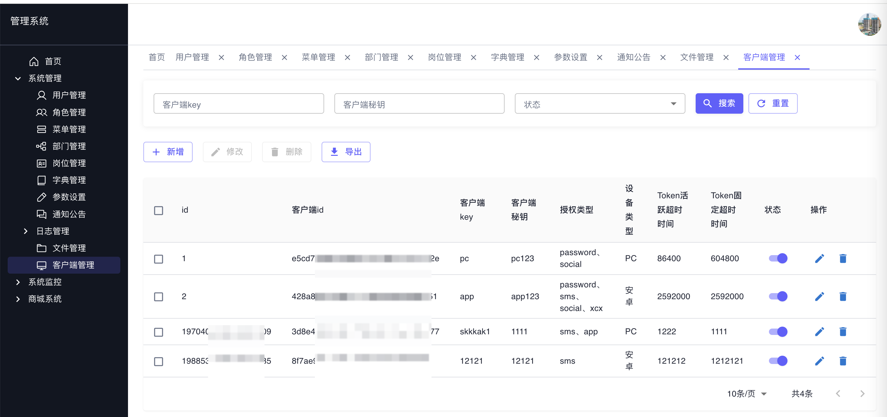

### 个人信息

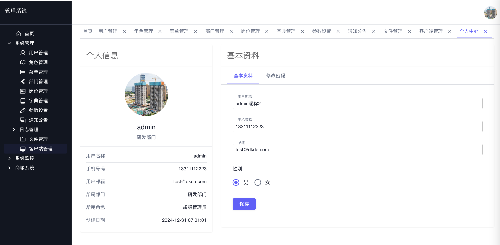

## 手机端

### 登录

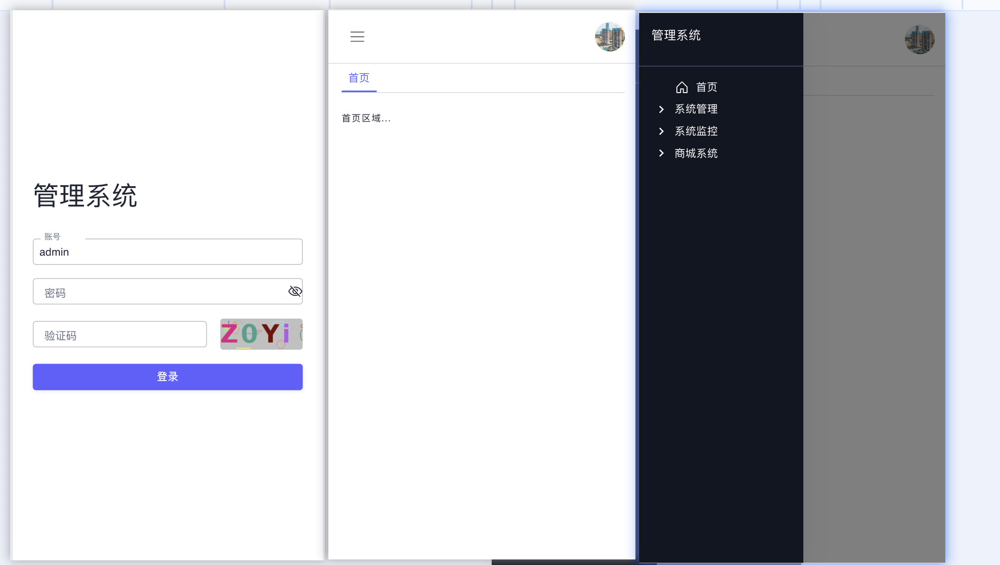

### 用户管理，角色管理，通知公告

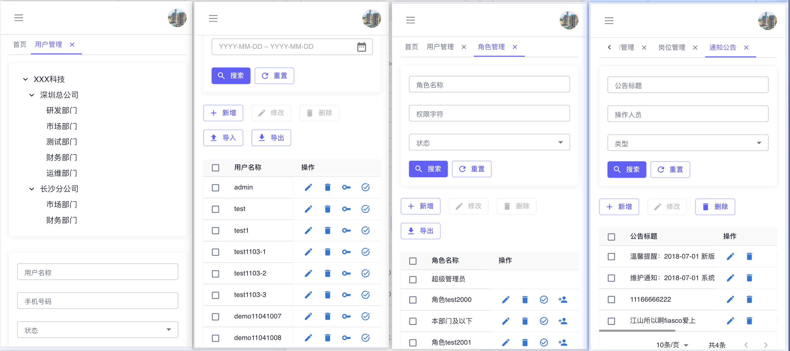
